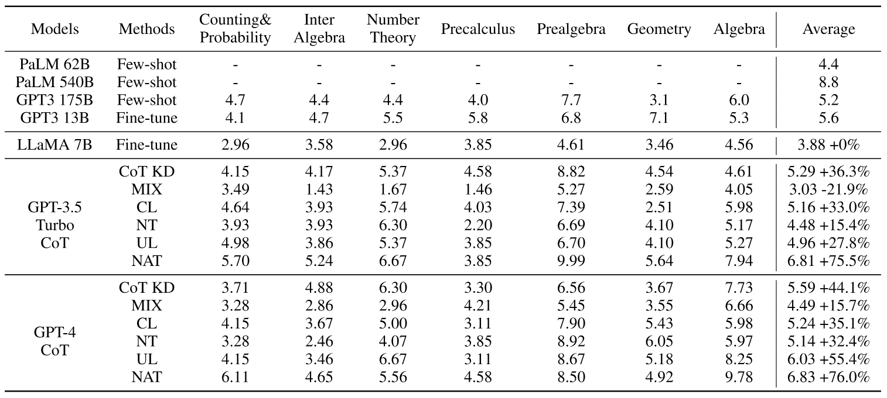

# Turning Dust into Gold [AAAI 2024]

## 
This is the repo for AAAI 2024 paper: Turning Dust into Gold: Distilling Complex Reasoning Capabilities from LLMs by
Leveraging Negative Data. [[Arxiv](https://arxiv.org/abs/2312.12832)]

The repo contains:
- The synthetic data from ChatGPT and GPT4.
- The training and inference code for this work.
- The experimental results.
- Current works related to MATH dataset and math reasoning.

## Data
We provide the synthetic samples from GPT3.5-turbo/GPT4 through ICL on the MATH training set, which are saved in the data folder _GPT3.5-turbo-MATH_ and _GPT4-MATH_.
For each sample, 8 samples are generated.  
The demonstrations for generating rationales are in our paper.

## Code
The training and inference code are as follows:

### step1:
prepare llama-7b checkpoint and store it in the code directory

### step2:
prepare conda environment with requirements.txt

### step3:
> conda activate llm

### step4:
training LoRA-neg
> cd code
>
> bash run_neg.sh

### step5:
training LoRA-NAT
> bash run_NAT.sh

### step6:
training NCE
> bash run_NCE.sh

### step7:
training ASC
> bash run_ASC.sh

### 

## Results

## A list of work related to MATH and math reasoning
We have also organized some work related to the MATH dataset and mathematical reasoning tasks to promote future research
### A. Involves distillation on mathematical reasoning tasks

### 1. Teaching Small Language Models to Reason（[Lucie Charlotte Magister](https://arxiv.org/search/cs?searchtype=author&query=Magister%2C+L+C), [Jonathan Mallinson](https://arxiv.org/search/cs?searchtype=author&query=Mallinson%2C+J), [Jakub Adamek](https://arxiv.org/search/cs?searchtype=author&query=Adamek%2C+J), [Eric Malmi](https://arxiv.org/search/cs?searchtype=author&query=Malmi%2C+E), [Aliaksei Severyn](https://arxiv.org/search/cs?searchtype=author&query=Severyn%2C+A)）

#### 	paper：https://arxiv.org/abs/2212.08410

#### 

#### 	2. Specializing Smaller Language Models towards Multi-Step Reasoning（[Yao Fu](https://arxiv.org/search/cs?searchtype=author&query=Fu%2C+Y), [Hao Peng](https://arxiv.org/search/cs?searchtype=author&query=Peng%2C+H), [Litu Ou](https://arxiv.org/search/cs?searchtype=author&query=Ou%2C+L), [Ashish Sabharwal](https://arxiv.org/search/cs?searchtype=author&query=Sabharwal%2C+A), [Tushar Khot](https://arxiv.org/search/cs?searchtype=author&query=Khot%2C+T)）

#### 	paper：https://arxiv.org/abs/2301.12726

#### 	code：https://github.com/FranxYao/FlanT5-CoT-Specialization

#### 	dataset：[Google Drive](https://drive.google.com/drive/folders/1BOXcUTnEyvQia_ypHcaUnUbLsN4HzqmQ?usp=sharing)

#### 

#### 	3. Large Language Models Are Reasoning Teachers（[Namgyu Ho](https://arxiv.org/search/cs?searchtype=author&query=Ho%2C+N), [Laura Schmid](https://arxiv.org/search/cs?searchtype=author&query=Schmid%2C+L), [Se-Young Yun](https://arxiv.org/search/cs?searchtype=author&query=Yun%2C+S)）

#### 	paper：https://arxiv.org/abs/2212.10071

#### 	code：https://github.com/itsnamgyu/reasoning-teacher

#### 	dataset：[Dropbox](https://www.dropbox.com/sh/hwcncpyomx87h20/AACqgVdd-ZzBQ3ncJcKqw0cVa?dl=0) 、 [Google Drive](https://drive.google.com/drive/folders/1C6kah3WV36N8omlUl-TeU9tsJADZNaJV?usp=share_link)

#### 

#### 	4. PaD: Program-aided Distillation Specializes Large Models in Reasoning（[Xuekai Zhu](https://arxiv.org/search/cs?searchtype=author&query=Zhu%2C+X), [Biqing Qi](https://arxiv.org/search/cs?searchtype=author&query=Qi%2C+B), [Kaiyan Zhang](https://arxiv.org/search/cs?searchtype=author&query=Zhang%2C+K), [Xingwei Long](https://arxiv.org/search/cs?searchtype=author&query=Long%2C+X), [Bowen Zhou](https://arxiv.org/search/cs?searchtype=author&query=Zhou%2C+B)）

#### 	paper：https://arxiv.org/abs/2305.13888

#### 

### B. Experiment on the MATH dataset

#### 	1. Measuring Mathematical Problem Solving With the MATH Dataset（original paper）（[Dan Hendrycks](https://arxiv.org/search/cs?searchtype=author&query=Hendrycks%2C+D), [Collin Burns](https://arxiv.org/search/cs?searchtype=author&query=Burns%2C+C), [Saurav Kadavath](https://arxiv.org/search/cs?searchtype=author&query=Kadavath%2C+S), [Akul Arora](https://arxiv.org/search/cs?searchtype=author&query=Arora%2C+A), [Steven Basart](https://arxiv.org/search/cs?searchtype=author&query=Basart%2C+S), [Eric Tang](https://arxiv.org/search/cs?searchtype=author&query=Tang%2C+E), [Dawn Song](https://arxiv.org/search/cs?searchtype=author&query=Song%2C+D), [Jacob Steinhardt](https://arxiv.org/search/cs?searchtype=author&query=Steinhardt%2C+J)）

#### 	paper：https://arxiv.org/abs/2103.03874

#### 	code：https://github.com/hendrycks/math

#### 	dataset： https://drive.google.com/file/d/1hQsua3TkpEmcJD_UWQx8dmNdEZPyxw23/view?usp=sharing

#### 

#### 	2.  Sparks of Artificial General Intelligence: Early experiments with GPT-4（[Sébastien Bubeck](https://arxiv.org/search/cs?searchtype=author&query=Bubeck%2C+S), [Varun Chandrasekaran](https://arxiv.org/search/cs?searchtype=author&query=Chandrasekaran%2C+V), [Ronen Eldan](https://arxiv.org/search/cs?searchtype=author&query=Eldan%2C+R), [Johannes Gehrke](https://arxiv.org/search/cs?searchtype=author&query=Gehrke%2C+J), [Eric Horvitz](https://arxiv.org/search/cs?searchtype=author&query=Horvitz%2C+E), [Ece Kamar](https://arxiv.org/search/cs?searchtype=author&query=Kamar%2C+E), [Peter Lee](https://arxiv.org/search/cs?searchtype=author&query=Lee%2C+P), [Yin Tat Lee](https://arxiv.org/search/cs?searchtype=author&query=Lee%2C+Y+T), [Yuanzhi Li](https://arxiv.org/search/cs?searchtype=author&query=Li%2C+Y), [Scott Lundberg](https://arxiv.org/search/cs?searchtype=author&query=Lundberg%2C+S), [Harsha Nori](https://arxiv.org/search/cs?searchtype=author&query=Nori%2C+H), [Hamid Palangi](https://arxiv.org/search/cs?searchtype=author&query=Palangi%2C+H), [Marco Tulio Ribeiro](https://arxiv.org/search/cs?searchtype=author&query=Ribeiro%2C+M+T), [Yi Zhang](https://arxiv.org/search/cs?searchtype=author&query=Zhang%2C+Y)）

#### 	paper：https://arxiv.org/abs/2303.12712

#### 	code：https://github.com/guidance-ai/guidance

#### 

#### 3. A Neural Network Solves, Explains, and Generates University Math Problems by Program Synthesis and Few-Shot Learning at Human Level（[Iddo Drori](https://arxiv.org/search/cs?searchtype=author&query=Drori%2C+I), [Sarah Zhang](https://arxiv.org/search/cs?searchtype=author&query=Zhang%2C+S), [Reece Shuttleworth](https://arxiv.org/search/cs?searchtype=author&query=Shuttleworth%2C+R), [Leonard Tang](https://arxiv.org/search/cs?searchtype=author&query=Tang%2C+L), [Albert Lu](https://arxiv.org/search/cs?searchtype=author&query=Lu%2C+A), [Elizabeth Ke](https://arxiv.org/search/cs?searchtype=author&query=Ke%2C+E), [Kevin Liu](https://arxiv.org/search/cs?searchtype=author&query=Liu%2C+K), [Linda Chen](https://arxiv.org/search/cs?searchtype=author&query=Chen%2C+L), [Sunny Tran](https://arxiv.org/search/cs?searchtype=author&query=Tran%2C+S), [Newman Cheng](https://arxiv.org/search/cs?searchtype=author&query=Cheng%2C+N), [Roman Wang](https://arxiv.org/search/cs?searchtype=author&query=Wang%2C+R), [Nikhil Singh](https://arxiv.org/search/cs?searchtype=author&query=Singh%2C+N), [Taylor L. Patti](https://arxiv.org/search/cs?searchtype=author&query=Patti%2C+T+L), [Jayson Lynch](https://arxiv.org/search/cs?searchtype=author&query=Lynch%2C+J), [Avi Shporer](https://arxiv.org/search/cs?searchtype=author&query=Shporer%2C+A), [Nakul Verma](https://arxiv.org/search/cs?searchtype=author&query=Verma%2C+N), [Eugene Wu](https://arxiv.org/search/cs?searchtype=author&query=Wu%2C+E), [Gilbert Strang](https://arxiv.org/search/cs?searchtype=author&query=Strang%2C+G)）

#### paper：https://arxiv.org/abs/2112.15594

#### code：https://github.com/idrori/mathq

#### 

#### 4. ChatCoT: Tool-Augmented Chain-of-Thought Reasoning on Chat-based Large Language Models（Zhipeng Chen, Kun Zhou, Beichen Zhang, Zheng Gong, Wayne Xin Zhao, Ji-Rong Wen）

#### paper：https://arxiv.org/abs/2305.14323

#### dataset：MATH、HotPotQA

#### 

#### 5.Deductive Verification of Chain-of-Thought Reasoning（Zhan Ling, Yunhao Fang, Xuanlin Li, Zhiao Huang, Mingu Lee, Roland Memisevic, Hao Su）

#### paper：https://arxiv.org/abs/2306.03872

#### dataset：MATH

#### 

#### 6.CREATOR: Disentangling Abstract and Concrete Reasonings of Large Language Models through Tool Creation（Cheng Qian, Chi Han, Yi R. Fung, Yujia Qin, Zhiyuan Liu, Heng Ji）

#### paper：https://arxiv.org/abs/2305.14318

#### dataset：MATH、TabMWP、Creation Challenge

#### 

#### 7.An Empirical Study on Challenging Math Problem Solving with GPT-4 （Yiran Wu, Feiran Jia, Shaokun Zhang, Hangyu Li, Erkang Zhu, Yue Wang, Yin Tat Lee, Richard Peng, Qingyun Wu, Chi Wang）

####  paper：https://arxiv.org/abs/2306.01337

#### 

#### 8.Cost-Effective Hyperparameter Optimization for Large Language Model Generation Inference （Chi Wang, Susan Xueqing Liu, Ahmed H. Awadallah）

#### paper：https://arxiv.org/abs/2303.04673

#### 

### C. Research work related to MATH

#### 1. MINIF2F: A CROSS-SYSTEM BENCHMARK FOR FORMAL OLYMPIAD-LEVEL MATHEMATICS（[Kunhao Zheng](https://arxiv.org/search/cs?searchtype=author&query=Zheng%2C+K), [Jesse Michael Han](https://arxiv.org/search/cs?searchtype=author&query=Han%2C+J+M), [Stanislas Polu](https://arxiv.org/search/cs?searchtype=author&query=Polu%2C+S)）

##### （Drawing on the MATH dataset,  propose miniF2F）

#### paper：https://arxiv.org/abs/2109.00110

#### code：https://github.com/openai/minif2f

#### 

#### 2. DRAFT, SKETCH, AND PROVE: GUIDING FORMALTHEOREM PROVERS WITH INFORMAL PROOFS（[Albert Q. Jiang](https://arxiv.org/search/cs?searchtype=author&query=Jiang%2C+A+Q), [Sean Welleck](https://arxiv.org/search/cs?searchtype=author&query=Welleck%2C+S), [Jin Peng Zhou](https://arxiv.org/search/cs?searchtype=author&query=Zhou%2C+J+P), [Wenda Li](https://arxiv.org/search/cs?searchtype=author&query=Li%2C+W), [Jiacheng Liu](https://arxiv.org/search/cs?searchtype=author&query=Liu%2C+J), [Mateja Jamnik](https://arxiv.org/search/cs?searchtype=author&query=Jamnik%2C+M), [Timothée Lacroix](https://arxiv.org/search/cs?searchtype=author&query=Lacroix%2C+T), [Yuhuai Wu](https://arxiv.org/search/cs?searchtype=author&query=Wu%2C+Y), [Guillaume Lample](https://arxiv.org/search/cs?searchtype=author&query=Lample%2C+G)）

##### （ MATH is only used as a source of informal data, a way to map informal proofs to formal proofs）

#### paper：https://arxiv.org/abs/2210.12283

#### code：https://github.com/facebookresearch/minif2f

#### 			https://github.com/albertqjiang/draft_sketch_prove

#### 

#### 3.  LAMBADA: Backward Chaining for Automated Reasoning in Natural Language（[Mehran Kazemi](https://arxiv.org/search/cs?searchtype=author&query=Kazemi%2C+M), [Najoung Kim](https://arxiv.org/search/cs?searchtype=author&query=Kim%2C+N), [Deepti Bhatia](https://arxiv.org/search/cs?searchtype=author&query=Bhatia%2C+D), [Xin Xu](https://arxiv.org/search/cs?searchtype=author&query=Xu%2C+X), [Deepak Ramachandran](https://arxiv.org/search/cs?searchtype=author&query=Ramachandran%2C+D)）

##### （The reference is the post pretrain method in MATH, reverse reasoning）

#### paper：https://arxiv.org/abs/2212.13894

#### 

#### 4.AGIEval: A Human-Centric Benchmark for Evaluating Foundation Models（[Wanjun Zhong](https://arxiv.org/search/cs?searchtype=author&query=Zhong%2C+W), [Ruixiang Cui](https://arxiv.org/search/cs?searchtype=author&query=Cui%2C+R), [Yiduo Guo](https://arxiv.org/search/cs?searchtype=author&query=Guo%2C+Y), [Yaobo Liang](https://arxiv.org/search/cs?searchtype=author&query=Liang%2C+Y), [Shuai Lu](https://arxiv.org/search/cs?searchtype=author&query=Lu%2C+S), [Yanlin Wang](https://arxiv.org/search/cs?searchtype=author&query=Wang%2C+Y), [Amin Saied](https://arxiv.org/search/cs?searchtype=author&query=Saied%2C+A), [Weizhu Chen](https://arxiv.org/search/cs?searchtype=author&query=Chen%2C+W), [Nan Duan](https://arxiv.org/search/cs?searchtype=author&query=Duan%2C+N)）

##### (MATH is part of the benchmark, AGIEval: A Human-Centric Benchmark for Evaluating Base Models)

#### paper：https://arxiv.org/abs/2304.06364

#### code：https://github.com/microsoft/agieval

#### dataset： [data/v1](https://github.com/microsoft/AGIEval/blob/main/data/v1) 

### 	